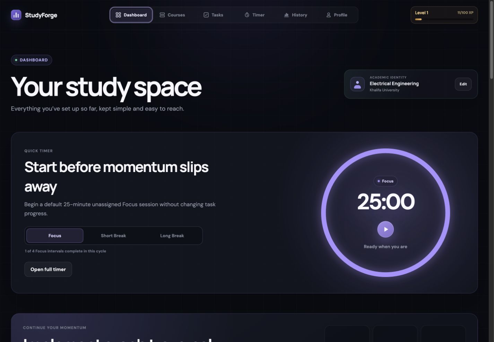
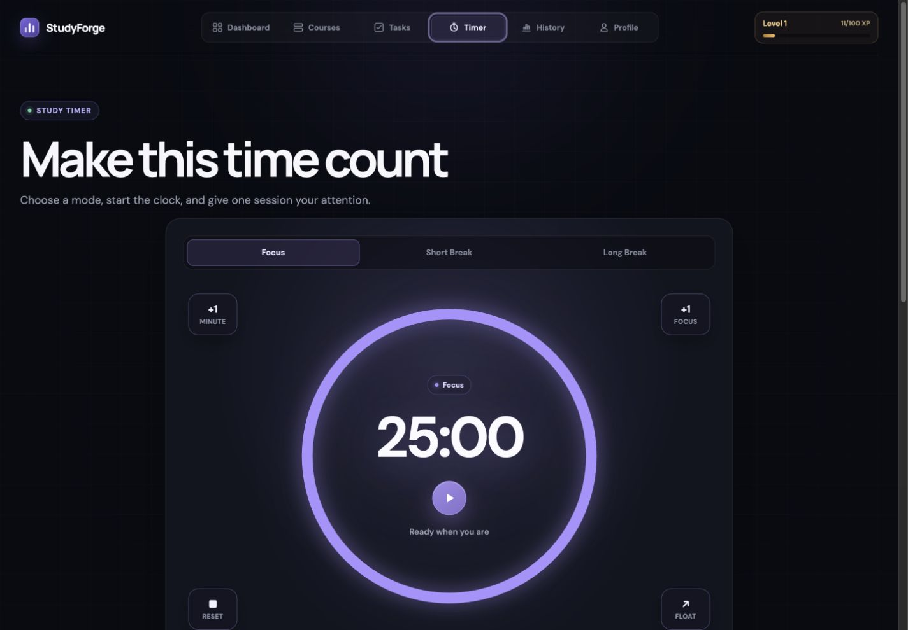
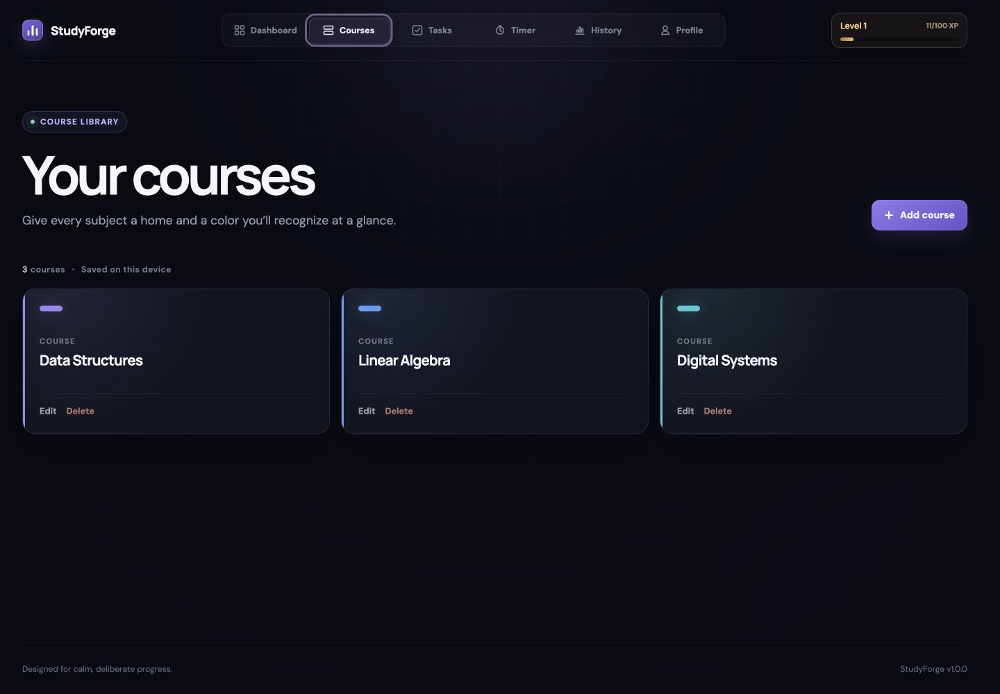
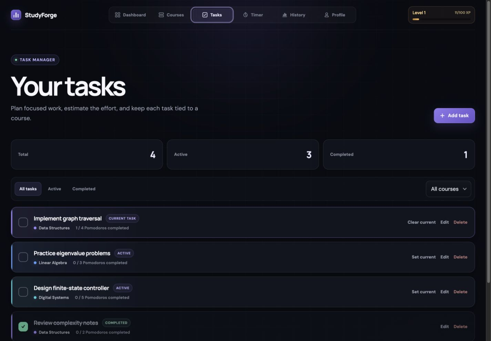
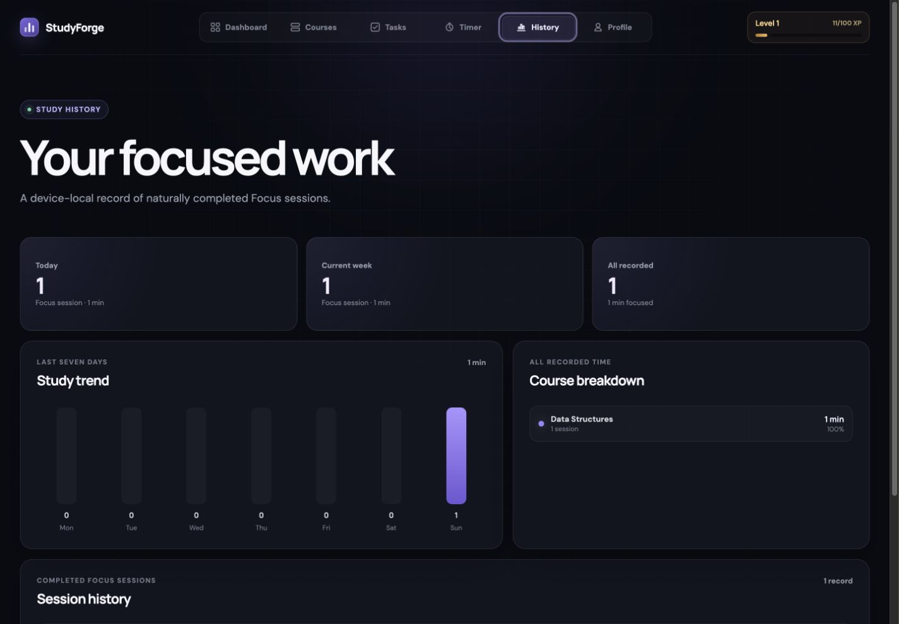
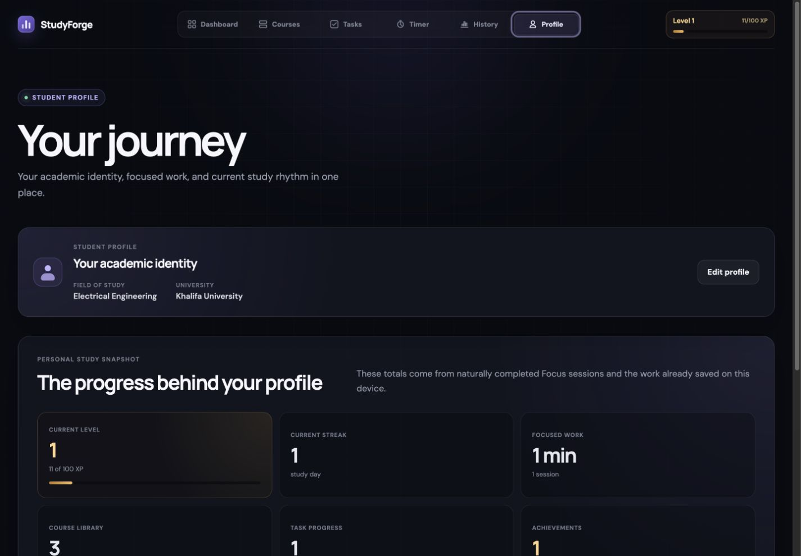
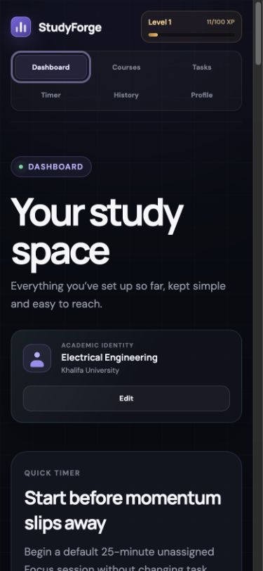

# StudyForge

StudyForge is a local-first university study planner for turning course work
into deliberate Focus sessions. It combines course-linked tasks, a reliable
Pomodoro timer, study history, useful statistics, and restrained progress
rewards in a responsive dark interface.

**Release:** 1.0.0

**Status:** Milestones 1-12

**Live app:** Added after the approved Vercel deployment

> StudyForge has no accounts, backend, database, analytics service, or cloud
> sync. Each visitor's saved data stays in that browser's `localStorage`.

## Interface

### Dashboard



### Circular Timer



### Courses and tasks





### History and Profile





### Mobile



## What you can do

### Plan courses and tasks

- Create, edit, color-code, and safely delete courses
- Create course-linked tasks with fixed Pomodoro estimates
- Filter, complete, reopen, and delete tasks
- Select one active task for a Focus session
- Protect courses that still have linked tasks
- Keep task completion manual, even after an estimate is reached

### Run reliable Focus sessions

- Switch between Focus, Short Break, and Long Break modes
- Start, pause, resume, reset, and add one minute
- Change the temporary Focus-cycle target without changing the countdown
- Use a timestamp-based timer that stays accurate in throttled tabs
- Start a default unassigned 25-minute Quick Focus from Dashboard
- Enter fullscreen or open the shared timer in Picture-in-Picture or a popup
- Keep the active countdown deliberately memory-only

### Understand study progress

- Record exactly one History entry per naturally completed Focus session
- Track today, the current week, seven-day trends, and per-course Focus time
- Preserve task and course snapshots when the original records change
- Earn minute-based XP plus a 10% Focus-completion bonus
- Build gradually increasing levels and local-calendar study streaks
- Unlock six restrained achievements
- Earn a one-time manual task-completion bonus

### Use it comfortably

- Navigate separate Dashboard, Courses, Tasks, Timer, History, and Profile views
- Set up or edit the local academic identity directly from Dashboard
- Restore the last valid view after a normal reload
- Use responsive desktop, tablet, and mobile layouts
- Work with keyboard-accessible controls, dropdowns, dialogs, and FAQ regions
- Receive visible and screen-reader status feedback
- Respect reduced-motion preferences
- Recover safely from malformed or unavailable browser storage

## Product tour

The Dashboard brings together a shared Quick Focus timer, current-task
direction, today and weekly totals, a seven-day trend, recent sessions,
per-course progress, reward progress, profile context, and an educational
introduction to the Pomodoro Technique.

Its academic-identity tile opens an accessible editor when no profile exists
and changes to the saved university or field of study after setup.

The Timer view centers a responsive circular countdown ring. Focus uses violet,
Short Break uses teal, and Long Break uses blue. The ring, fullscreen panel,
floating view, Dashboard timer, task progress, History, and rewards all share
one timer engine and one exactly-once completion path.

Courses and Tasks provide the planning layer. Every task belongs to an existing
course, estimates never change automatically, and neither reaching an estimate
nor completing a Focus session automatically completes a task.

History turns naturally completed Focus sessions into useful evidence without
inventing activity for pauses, resets, cancelled sessions, breaks, settings
changes, reloads, or manual mode switches.

Profile presents the saved academic identity, Level and visible XP, streak,
all-time Focus work, course and task totals, achievements, and the current timer
rhythm.

## Persistence and privacy

StudyForge stores approved durable state in one validated and versioned
`localStorage` record:

- Profile and courses
- Tasks, completion state, estimates, and completed Pomodoros
- Timer settings and completed intervals in the current cycle
- Active-task selection and last valid application view
- Completed Focus-session History
- XP, fractional Focus bonuses, levels, streaks, achievements, and one-time task
  reward records

Closing a tab, quitting the browser, restarting the computer, or normally
reloading the page does not usually remove that data. It can be removed by
clearing StudyForge's site data, using and closing a private-browsing session,
resetting the browser profile, or opening the app in a different browser,
profile, or device.

The current running or paused countdown, target timestamp, and remaining
seconds are not persisted. Reloading returns the timer to a fresh Focus session
without fabricating a completion, History entry, task update, streak change, or
reward.

Storage schema 4 safely migrates supported earlier StudyForge records. Earlier
sessions never receive retroactive Focus-completion bonuses, previously handled
tasks cannot earn a second completion bonus, and malformed records fall back to
safe defaults without making the application unusable.

## Accessibility

StudyForge includes a semantic main-content region and skip link, visible focus
indicators, touch-friendly controls, accessible names for repeated actions,
associated form errors, polite live regions, and reduced-motion fallbacks.

Dialogs provide initial focus, Tab and Shift+Tab containment, Escape handling,
background inertness, scroll locking, safe focus restoration, and safe-action
initial focus for destructive confirmations. Custom dropdowns support keyboard,
mouse, touch, and screen-reader use with Arrow keys, Home, End, Enter, Space,
Escape, and Tab.

## Technology

- React 19
- Vite 6
- JavaScript
- CSS and inline SVG
- Browser `localStorage`
- Vercel static hosting

There are no paid APIs or runtime service dependencies.

## Run locally

You need a current version of [Node.js](https://nodejs.org/).

```bash
npm install
npm run dev
```

Open the local address printed by Vite, usually
`http://localhost:5173`.

## Production build

```bash
npm run build
npm run preview
```

`npm run build` creates the optimized static application in `dist/`.
The included `vercel.json` uses the same command and output directory.

## Project structure

```text
studyforge/
├── docs/
│   └── screenshots/       # Privacy-safe public interface captures
├── src/
│   ├── App.jsx            # Application views, timer engine, and interactions
│   ├── main.jsx           # React entry point
│   ├── persistence.js     # Versioned storage, validation, and migration
│   ├── rewardUtils.js     # XP, levels, streaks, achievements, and repair
│   ├── statisticsUtils.js # Session records and study statistics
│   ├── taskUtils.js       # Task validation, filtering, and list rules
│   └── styles.css         # Responsive visual and motion system
├── index.html
├── package.json
├── PROJECT_STATE.md
├── vercel.json
└── vite.config.js
```

## Release scope

Version 1.0.0 is the completed Milestones 1-12 release. It intentionally does
not include accounts, authentication, cloud sync, a backend, deadlines,
priorities, recurring tasks, calendar features, advanced recommendations,
social features, notifications, backup/import/export, or PWA installability.

The public app requires an internet connection to open or reload reliably.
Once loaded, its core planning and timer behavior does not depend on a backend.

## Project history

The product was developed milestone by milestone, from its visual foundation
through courses, profile, timer, tasks, unified persistence, History,
statistics, restrained rewards, accessibility polish, interface expansion, and
the 1.0 release. [PROJECT_STATE.md](PROJECT_STATE.md) contains the detailed
implementation and migration record.

The Pomodoro Technique name and method belong to their respective owner.
StudyForge is an independent educational project and is not affiliated with the
official Pomodoro Technique organization.
